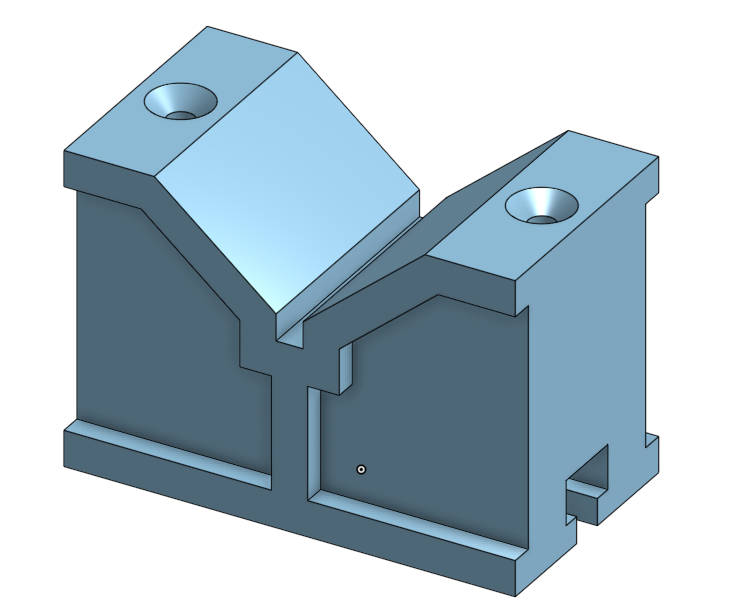
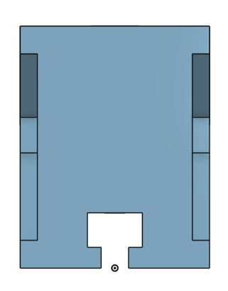
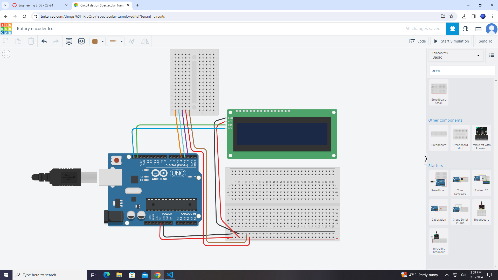
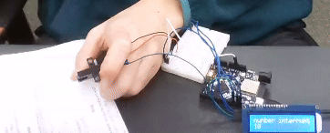
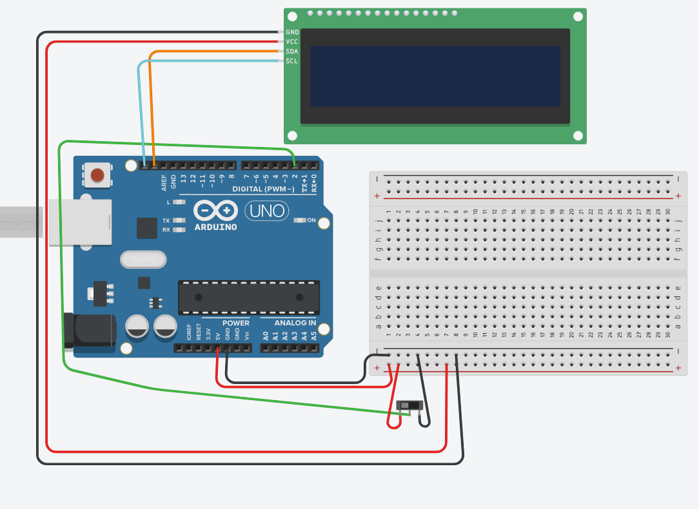
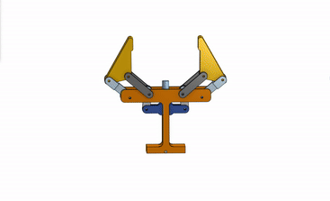

# CircuitPython
engr 3 notebook

## Table of Contents
* [Table of Contents](#TableOfContents)
* [Hello CircuitPython](#Hello_CircuitPython)
* [CircuitPython Servo](#CircuitPython_Servo)
* [CircuitPython UltrasonicSensor](#Ultrasonic_sensor)
* [Motor Control](#motor_control)
* [Swing Arm](#Swing_Arm)
* [Hanger](#hanger)
* [Multi-part cylinder](#multi-part_cylinder)
* [V-Block practice part](#v-block)
* [Rotary encoder & lcd](#rotary_encoder__lcd)
* [Photointerrupter](#photointerrupter)
* [Stepper_motor_&_Limit_switch](#stepper_motor__limit_switch)
* [Robot_Gripper](#robot-gripper)


---

## Hello_CircuitPython

### Description & Code
Description goes here

Here's how you make code look like code:

```python
Code goes here

```


### Evidence


And here is how you should give image credit to someone if you use their work:

Image credit goes to [Rick A](https://www.youtube.com/watch?v=dQw4w9WgXcQ&scrlybrkr=8931d0bc)

![wiring_diagram] (media/Circuitpyservo.mp4)


### Wiring
Make an account with your Google ID at [tinkercad.com](https://www.tinkercad.com/learn/circuits), and use "TinkerCad Circuits to make a wiring diagram."  It's really easy!  
Then post an image here.   [here's a quick tutorial for all markdown code, like making links](https://guides.github.com/features/mastering-markdown/)

### Reflection
What went wrong / was challenging, how'd you figure it out, and what did you learn from that experience?  Your ultimate goal for the reflection is to pass on the knowledge that will make this assignment better or easier for the next person.


## How To Fix the LCD power issue with Metro M4 boards.

### Description & Code

* **The symptoms:**  LCD acting weird OR trouble with usb connection / serial monitor / uploading / etc.
* **The problem :** The LCDs occasionally draw too much power when we turn on the boards, and that makes parts of its serial communications crash.
* **The Solution:** Add this code, and wire a switch up, like the wiring diagram below:


```python
import board
import time
import digitalio
from lcd.lcd import LCD
from lcd.i2c_pcf8574_interface import I2CPCF8574Interface

# turn on lcd power switch pin
lcdPower = digitalio.DigitalInOut(board.D8)
lcdPower.direction = digitalio.Direction.INPUT
lcdPower.pull = digitalio.Pull.DOWN

# Keep the I2C protocol from running until the LCD has been turned on
# You need to flip the switch on the breadboard to do this.
while lcdPower.value is False:
    print("still sleeping")
    time.sleep(0.1)

# Time to start up the LCD!
time.sleep(1)
print(lcdPower.value)
print("running")

i2c = board.I2C()
lcd = LCD(I2CPCF8574Interface(i2c, 0x27), num_rows=2, num_cols=16)


# Loop forever.
while True:

```
### Wiring


# CircuitPython_Servo

### Description & Code

For this assignment we were assigned to make a servo move based on two buttons that were being pressed. When you press one button, the servo would start
moving one way, and when you pressed the other button it would start moving the other way. 

```python
import time
import board
import pwmio
from digitalio import DigitalInOut, Direction, Pull
from adafruit_motor import servo

# create a PWMOut object on Pin A2.
pwm = pwmio.PWMOut(board.A2, duty_cycle=2 ** 15, frequency=50)

# Create a servo object, my_servo.
my_servo = servo.Servo(pwm)

btn = DigitalInOut(board.D6) #assign digital pins to buttons
btn.direction = Direction.INPUT
btn.pull = Pull.DOWN 
btn2 = DigitalInOut(board.D2)
btn2.direction = Direction.INPUT
btn2.pull = Pull.DOWN

angle = 90 #starter angle to declare variable

while True:#like void loop for arduino, if btn.value is saying if button is pressed
    if btn.value and angle > 5: # only running this loop when it's above 5 keeps angle from going out of range
        print(angle)    
        angle = angle -5 #make angle variable lower
        my_servo.angle = angle #set servo angle to variable
        time.sleep(0.05)
    if btn2.value and angle < 170:# keeps angle from going out of range on the other end
        print(angle)
        angle = angle + 5 
        my_servo.angle = angle #moving servo in the other direction
        time.sleep(0.05)


    time.sleep(0.1) # sleep for debounce
```

### Evidence


### Wiring


### Reflection 

The hardest part of this assignment for me was probably figuring out how to work the buttons using circuitpython and then combining the servo and
arduino code. I started trying to use buttons along with the servo without ever starting with buttons, which meant I struggled for a bit. The servo
part of this assignment was just a matter of finding some servo code that worked well and pasting it into vs code. 


# Ultrasonic_sensor

### Description & Code

For this assignment, we were supposed to make an rgb led glow in a color of the rainbow according to the distance recieved by an ultrasonic sensor. 
It was supposed to be red when the object was 5 or less cm away, then shift up to blue as it got up to 20 cm, then to green as it approached 35 cm.

```python
import time #librarby
import board
import adafruit_hcsr04
import neopixel
import simpleio

NUMPIXELS = 1  # Update this to match the number of LEDs.
BRIGHTNESS = 0.05 # A number between 0.0 and 1.0, where 0.0 is off, and 1.0 is max.
PIN = board.NEOPIXEL  # This is the default pin on the 5x5 NeoPixel Grid BFF.

sonar = adafruit_hcsr04.HCSR04(trigger_pin=board.D5, echo_pin=board.D6) #setup for ultrasonic, define pins and stuff

pixels = neopixel.NeoPixel(PIN, NUMPIXELS, brightness=BRIGHTNESS, auto_write=False)#setup for neopixels

blue = 0 #variables for each color to use
red = 0
green = 0

while True:
    try:
        print((sonar.distance)) #tell me how far away object is
        if (sonar.distance>=5 and sonar.distance<20): #red to blue distance
            blue=simpleio.map_range(sonar.distance,5,20,0,255) #blue is highest at 20 lowest at 0
            red=simpleio.map_range(sonar.distance,5,20,255,0) #red is highest at 0 lowest at 20
            green=0 #don't need green, so set it to 0
            pixels.fill((red,green,blue)) #sets each variable as the color it's supposed to be, use rgb order
            pixels.show()# prints values to led
            
        if (sonar.distance>=20 and sonar.distance<35):#blue to green distance
            blue=simpleio.map_range(sonar.distance,20,35,255,0) #same idea as first if except blue is decreasing and green is increasing
            green=simpleio.map_range(sonar.distance,20,35,0,255)
            red=0
            pixels.fill((red,green,blue))#need another print because the first one won't be active if distance isn't in the correct range
            pixels.show()
    except RuntimeError: #don't want it to do anything if it gets an error, so just tell me and move on
        print("Retrying!")
    time.sleep(0.1)

    

```

### Evidence


### Wiring


### Reflection

This assignment took me quite a while. I struggled a lot with trying to print values taken from my ultrasonic sensor to the led,
but eventually Rafi gave me a function which really helped. I had some of the values in the wrong order close to the end, which
meant that the LED would go from red to green and then back to red, when it was supposed to go from red to blue to green. 


# Motor_control

### Description and Code

For this assignment, we were supposed to make a motor speed up according to the values being spit out by a potentiometer. This assignment
was designed to help us learn how to wire a motor without frying any parts, and how to code motors. 

### Evidence

This assignment wasn't completed, so I do not have a video of it working.

### Wiring


### Reflection

I didn't work very quickly, so I wasn't able to complete this assignment on time. The wiring wasn't too complicated, but the diagrams were a bit
of a struggle to read. 


# Swing_Arm

### Assignment Description

The purpose of this assignment was to practice for the onshape exam. We were meant to make a swing arm using a few drawings and 3 dimensions which we could change.


### Evidence


### Link 

(https://cvilleschools.onshape.com/documents/535a37c3c46d846caafb9616/w/38fe14ad2e16f8c84bbf5bc9/e/5b39fd5ad04f78a0c2185d85)

### Reflection

When I was filleting, there was one section of the part that could not be filleted correctly with the way that I had made it, so I went back to the initial sketch,
and added in a sketch fillet which worked. One other problem I came across was that when I changed the dimensions to make the new part, one of the arms was too thick.
I used the rollback bar and figured out that one of the sketches had used the old dimension of the B variable instead of the actual variable, which meant it didn't change.

&nbsp;


# Hanger

### Assignment Description

For this assignment, we were supposed to build a hanger in onshape using only the drawings, and compare the mass of the hanger with the mass it was supposed to have. 

### Evidence


### Link

(https://cvilleschools.onshape.com/documents/d1c1c33686da89b335825df9/w/d61aa3a7290e30b06198126a/e/cdad61fe382470d9c3da808c?renderMode=0&uiState=652d8e3ae5a1bc543bad632f)

### Reflection

The hardest part of doing this assignment was deciding how to start, but once I had done that, it was not difficult to continue doing the assignment. I also had a little bit
of trouble with the main curve of the hanger, but I managed to figure it out. I also used the mirror tool, which meant I really only had to make half of the hanger. 


# Multi-part_Cylinder

### Assignment Description

For this assignment, we were using several drawings in order to find the masses of a part as we made changes to it. This assignment was meant to help us practice for the
Onshape exam. 

### Evidence


### Link

(https://cvilleschools.onshape.com/documents/0d6498a1596a050a7b3d053d/w/5c4263bcbd63eb0a61602202/e/4139c3d63746489a8ffe07a7?renderMode=0&uiState=6543f5368c4c2a2a82489e42)

### Reflection

This assignment was good insight into what the Onshape exam will be like. I managed to make the parts pretty well using the drawings given, and I didn't directly dimension
any of the dimensions that were in parentheses. The revisions were mostly correct, but one of the masses was off. 


# V-block

### Assignment Description

For this assignment, we were supposed to use a series of drawings to create, then edit a single part. This assignment was meant to help us practice for the Onshape exam. 

### Evidence




### Link

(https://cvilleschools.onshape.com/documents/0d6498a1596a050a7b3d053d/w/5c4263bcbd63eb0a61602202/e/4139c3d63746489a8ffe07a7?renderMode=0&uiState=6543f5368c4c2a2a82489e42)

### Reflection

This assignment was not very difficult for me. I managed to get through it without too much difficulty. I learned that a lot of the little ridge on the part can be dimensioned
just by saying it's 5 millimeters wide. I did forget to change the part material to titanium from aluminum 1060, which messed up the mass I had. 


# Rotary_encoder_&_lcd

### Assignment Description and Code

For this assignment, we were assigned to use a rotary encoder to scroll through a menu on an LCD screen. When the rotary encoder's button was pressed, it was supposed to
light up a neopixel on the arduino according to the value of the menu. 

```python
import rotaryio
import board
import neopixel
import digitalio
from lib.lcd.lcd import LCD
from lib.lcd.i2c_pcf8574_interface import I2CPCF8574Interface

enc = rotaryio.IncrementalEncoder(board.D4, board.D3, divisor=2)

lcd = LCD(I2CPCF8574Interface(board.I2C(), 0x3f), num_rows=2, num_cols=16)
last_index = None
menu_index = 0
menu = ["stop", "caution", "go"]
led = neopixel.NeoPixel(board.NEOPIXEL, 1)
led.brightness = 0.3

button = digitalio.DigitalInOut(board.D2)
button.direction = digitalio.Direction.INPUT
button.pull = digitalio.Pull.UP
button_state = None

while True:
    menu_index = enc.position
    menu_indexlcd = menu_index % 3
    lcd.set_cursor_pos(0,0)
    lcd.print("Push for:") 
    lcd.set_cursor_pos(1,0)
    lcd.print("                     ")
    lcd.set_cursor_pos(1,0)
    lcd.print(menu[menu_indexlcd])
    if last_index is None or menu_index is not last_index:
        print(menu[menu_indexlcd])
        last_index = menu_index
    if not button.value and button_state is None:
        button_state = "pressed"
    if button.value and button_state == "pressed":
        print("Button is pressed")
        button_state = None
    if menu_indexlcd == 0 and button_state == "pressed":
        led[0] = (255, 0, 0)
    if menu_indexlcd == 1 and button_state == "pressed":
        led[0] = (175, 175, 0)
    if menu_indexlcd == 2 and button_state == "pressed":
        led[0] = (0, 255, 0)

```

### Evidence


### Wiring



### Reflection

This assignment was made a little bit easier by the fact that we didn't have to find the code on the internet or come up with it ourselves,
and I was mostly able to use the slideshow provided on canvas to write the code. The problems I did have to solve weren't too difficult, and
were mostly just things like making the neopixel follow the menu only when the button was pressed. Overall this assignment wasn't too hard, it
just took some time to learn about menus, and write the code. 


# Photointerrupter

### Assignment Description and Code

For this assignment, we were supposed to use a photointerrupter to make a number tick up on an LCD screen. When you put something in the photointerrupter
beam, it would register it, and tick a variable up by 1, which would be printed onto an LCD screen. 

```python
import time
import board
import digitalio
from lib.lcd.lcd import LCD
from lib.lcd.i2c_pcf8574_interface import I2CPCF8574Interface #librarby

interruptnum = 0 #number of interrupts

# Set up the photointerrupter using digital pin 2.
photointerrupter = digitalio.DigitalInOut(board.D2)

# Set the photointerrupter as an input.
photointerrupter.direction = digitalio.Direction.INPUT

# Use the internal pull-up resistor. 
photointerrupter.pull = digitalio.Pull.UP

# Set the photointerrupter_state as None for now!
photointerrupter_state = None   

lcd = LCD(I2CPCF8574Interface(board.I2C(), 0x3f), num_rows=2, num_cols=16)

while True:
     print(photointerrupter.value)
     lcd.set_cursor_pos(0,0) #setting where the text is printed on LCD screen
     lcd.print("number interrupt") #what text to write
     lcd.set_cursor_pos(1,0)
     lcd.print("                ")
     lcd.set_cursor_pos(1,0)
     lcd.print(str(interruptnum))#str is string, print the value of interruptnum
     print(interruptnum)
     if not photointerrupter.value and photointerrupter_state is None:# button stuff
          photointerrupter_state = "interrupted"
     if photointerrupter_state is "interrupted" :
          photointerrupter_state = None
     if photointerrupter.value is True:
          interruptnum = interruptnum + 1
     time.sleep(1.5) #deeeeeeebooouuunnnnccceee
```

### Evidence



### Wiring



I used a switch for the photointerrupter. 

### Reflection

This assignment wasn't too difficult. The wiring is pretty simple, and the code is very similar to something you'd use for a button. I used some of
my old code from the rotary encoder to do the button, and added in a variable for the number of interrupts that the photointerrupter had detected. 
I did run into a small problem when trying to print the value to the photointerrupter, but all I had to do was declare it was a string.  

# Stepper_motor_&_Limit_Switch

### Assignment Description and Code

For this assignment, we were supposed to make a stepper motor spin until an arm attached to it hit a limit switch. Once the switch was hit,
the motor changed direction for a short time.

```python
import asyncio
import board
import keypad
import time
import digitalio
from adafruit_motor import stepper


DELAY = 0.01   # Sets the delay time for in-between each step of the stepper motor.
STEPS = 100    # Sets the number of steps. 100 is half a full rotation for the motor we're using. 

# Set up the digital pins used for the four wires of the stepper motor. 
coils = (
    digitalio.DigitalInOut(board.D9),   # A1
    digitalio.DigitalInOut(board.D10),  # A2
    digitalio.DigitalInOut(board.D11),  # B1
    digitalio.DigitalInOut(board.D12),  # B2
)

# Sets each of the digital pins as an output.
for coil in coils:
    coil.direction = digitalio.Direction.OUTPUT

# Creates an instance of the stepper motor so you can send commands to it (using the Adafruit Motor library). 
motor = stepper.StepperMotor(coils[0], coils[1], coils[2], coils[3], microsteps=None)


async def catch_pin_transitions(pin):
    # Print a message when pin goes low and when it goes high.
    with keypad.Keys((pin,), value_when_pressed=False) as keys:
        while True:
            event = keys.events.get()
            if event:
                if event.pressed:
                    print("pressed")
                    for step in range(STEPS):
                        motor.onestep(direction=stepper.BACKWARD, style=stepper.DOUBLE)
                        time.sleep(DELAY)
                elif event.released:
                    print("released")
            await asyncio.sleep(0)

async def run_motor():
    while(True):
        for step in range(STEPS):
            motor.onestep(style=stepper.DOUBLE)
            time.sleep(DELAY)
            await asyncio.sleep(0)

async def main():
    while(True):
        interrupt_task = asyncio.create_task(catch_pin_transitions(board.D2))
        motor_task = asyncio.create_task(run_motor())
        await asyncio.gather(interrupt_task, motor_task)

asyncio.run(main())
```

### Wiring Diagram


### Evidence


### Reflection

This assignment took me a while because I couldn't figure out how to spin the motor properly. It turns out you need a for loop, and the indents are 
somewhat specific in what they allow and what they don't. I did learn how to use functions better, and I figured out some of the async functions.


# Robot Gripper

### Assignment Description

For this assignment, we were supposed to create a robot gripper that uses one actuator, and can fully close. 

### Evidence



### Link

(https://cvilleschools.onshape.com/documents/f5164bfdd1a83333d17435ab/w/df07c83dd6806d61d127fda7/e/1374e2fc981a20515c84e291?renderMode=0&uiState=65d4fe1223a5641aeadcdb91)

### Reflection

This assignment was pretty fun. I took heavy inspiration from a design I found on the internet, which ended up working pretty well. 
I learned a little bit more about slider mates, and how to animate things in an onshape assembly. I only made one of every part
in the part studio which sped things along. I also figured out that if a feature is difficult to mirror, sometimes you can mirror
the part and then use a boolean to make them into one part. 
