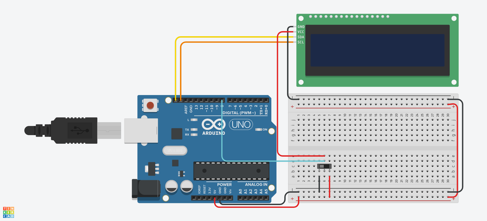
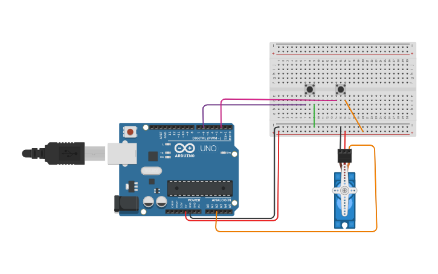
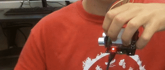
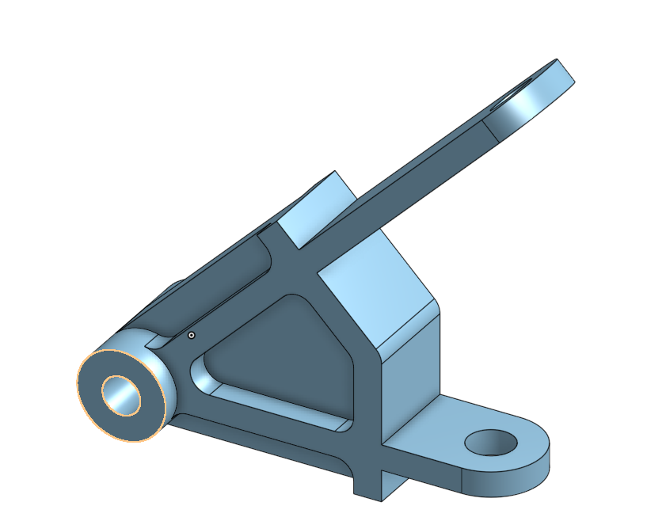
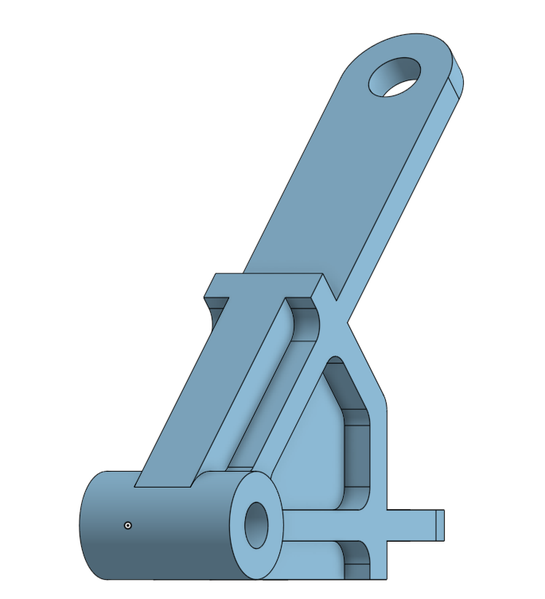
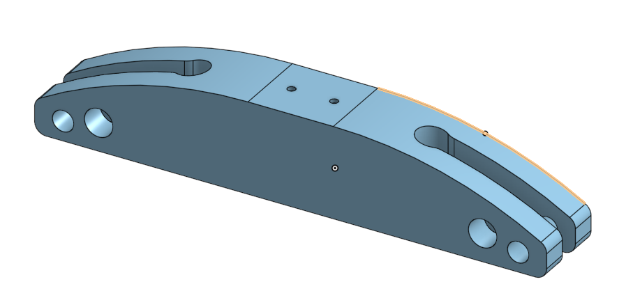
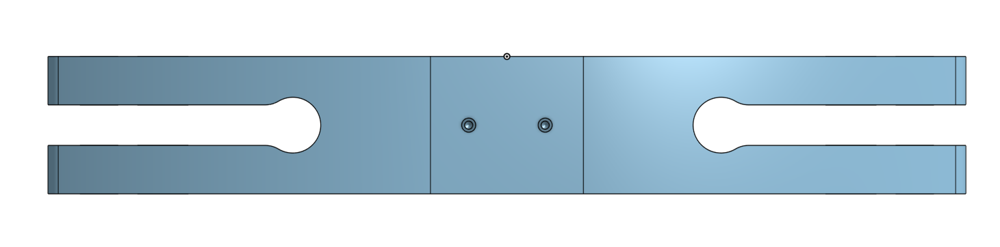

# CircuitPython
engr 3 notebook
;lkjnbh
## Table of Contents
* [Table of Contents](#TableOfContents)
* [Hello_CircuitPython](#Hello_CircuitPython)
* [CircuitPython_Servo](#CircuitPython_Servo)
* [CircuitPython_UltrasonicSensor](#Ultrasonic_sensor)
* [NextAssignmentGoesHere](#NextAssignment)
---

## Hello_CircuitPython

### Description & Code
Description goes here

Here's how you make code look like code:

```python
Code goes here

```


### Evidence


And here is how you should give image credit to someone if you use their work:

Image credit goes to [Rick A](https://www.youtube.com/watch?v=dQw4w9WgXcQ&scrlybrkr=8931d0bc)

![wiring_diagram] (media/Circuitpyservo.mp4)


### Wiring
Make an account with your Google ID at [tinkercad.com](https://www.tinkercad.com/learn/circuits), and use "TinkerCad Circuits to make a wiring diagram."  It's really easy!  
Then post an image here.   [here's a quick tutorial for all markdown code, like making links](https://guides.github.com/features/mastering-markdown/)

### Reflection
What went wrong / was challenging, how'd you figure it out, and what did you learn from that experience?  Your ultimate goal for the reflection is to pass on the knowledge that will make this assignment better or easier for the next person.


## How To Fix the LCD power issue with Metro M4 boards.

### Description & Code

* **The symptoms:**  LCD acting weird OR trouble with usb connection / serial monitor / uploading / etc.
* **The problem :** The LCDs occasionally draw too much power when we turn on the boards, and that makes parts of its serial communications crash.
* **The Solution:** Add this code, and wire a switch up, like the wiring diagram below:


```python
import board
import time
import digitalio
from lcd.lcd import LCD
from lcd.i2c_pcf8574_interface import I2CPCF8574Interface

# turn on lcd power switch pin
lcdPower = digitalio.DigitalInOut(board.D8)
lcdPower.direction = digitalio.Direction.INPUT
lcdPower.pull = digitalio.Pull.DOWN

# Keep the I2C protocol from running until the LCD has been turned on
# You need to flip the switch on the breadboard to do this.
while lcdPower.value is False:
    print("still sleeping")
    time.sleep(0.1)

# Time to start up the LCD!
time.sleep(1)
print(lcdPower.value)
print("running")

i2c = board.I2C()
lcd = LCD(I2CPCF8574Interface(i2c, 0x27), num_rows=2, num_cols=16)


# Loop forever.
while True:

```
### Wiring




# CircuitPython_Servo

### Description & Code

For this assignment we were assigned to make a servo move based on two buttons that were being pressed. When you press one button, the servo would start
moving one way, and when you pressed the other button it would start moving the other way. 

```python
import time
import board
import pwmio
from digitalio import DigitalInOut, Direction, Pull
from adafruit_motor import servo

# create a PWMOut object on Pin A2.
pwm = pwmio.PWMOut(board.A2, duty_cycle=2 ** 15, frequency=50)

# Create a servo object, my_servo.
my_servo = servo.Servo(pwm)

btn = DigitalInOut(board.D6) #assign digital pins to buttons
btn.direction = Direction.INPUT
btn.pull = Pull.DOWN 
btn2 = DigitalInOut(board.D2)
btn2.direction = Direction.INPUT
btn2.pull = Pull.DOWN

angle = 90 #starter angle to declare variable

while True:#like void loop for arduino, if btn.value is saying if button is pressed
    if btn.value and angle > 5: # only running this loop when it's above 5 keeps angle from going out of range
        print(angle)    
        angle = angle -5 #make angle variable lower
        my_servo.angle = angle #set servo angle to variable
        time.sleep(0.05)
    if btn2.value and angle < 170:# keeps angle from going out of range on the other end
        print(angle)
        angle = angle + 5 
        my_servo.angle = angle #moving servo in the other direction
        time.sleep(0.05)


    time.sleep(0.1) # sleep for debounce
```

### Evidence


### Wiring



### Reflection 

The hardest part of this assignment for me was probably figuring out how to work the buttons using circuitpython and then combining the servo and
arduino code. I started trying to use buttons along with the servo without ever starting with buttons, which meant I struggled for a bit. The servo
part of this assignment was just a matter of finding some servo code that worked well and pasting it into vs code. 


# Ultrasonic_sensor

### Description & Code

For this assignment, we were supposed to make an rgb led glow in a color of the rainbow according to the distance recieved by an ultrasonic sensor. 
It was supposed to be red when the object was 5 or less cm away, then shift up to blue as it got up to 20 cm, then to green as it approached 35 cm.

```python
import time #librarby
import board
import adafruit_hcsr04
import neopixel
import simpleio

NUMPIXELS = 1  # Update this to match the number of LEDs.
BRIGHTNESS = 0.05 # A number between 0.0 and 1.0, where 0.0 is off, and 1.0 is max.
PIN = board.NEOPIXEL  # This is the default pin on the 5x5 NeoPixel Grid BFF.

sonar = adafruit_hcsr04.HCSR04(trigger_pin=board.D5, echo_pin=board.D6) #setup for ultrasonic, define pins and stuff

pixels = neopixel.NeoPixel(PIN, NUMPIXELS, brightness=BRIGHTNESS, auto_write=False)#setup for neopixels

blue = 0 #variables for each color to use
red = 0
green = 0

while True:
    try:
        print((sonar.distance)) #tell me how far away object is
        if (sonar.distance>=5 and sonar.distance<20): #red to blue distance
            blue=simpleio.map_range(sonar.distance,5,20,0,255) #blue is highest at 20 lowest at 0
            red=simpleio.map_range(sonar.distance,5,20,255,0) #red is highest at 0 lowest at 20
            green=0 #don't need green, so set it to 0
            pixels.fill((red,green,blue)) #sets each variable as the color it's supposed to be, use rgb order
            pixels.show()# prints values to led
            
        if (sonar.distance>=20 and sonar.distance<35):#blue to green distance
            blue=simpleio.map_range(sonar.distance,20,35,255,0) #same idea as first if except blue is decreasing and green is increasing
            green=simpleio.map_range(sonar.distance,20,35,0,255)
            red=0
            pixels.fill((red,green,blue))#need another print because the first one won't be active if distance isn't in the correct range
            pixels.show()
    except RuntimeError: #don't want it to do anything if it gets an error, so just tell me and move on
        print("Retrying!")
    time.sleep(0.1)

    

```

### Evidence



### Wiring


### Reflection

This assignment took me quite a while. I struggled a lot with trying to print values taken from my ultrasonic sensor to the led,
but eventually Rafi gave me a function which really helped. I had some of the values in the wrong order close to the end, which
meant that the LED would go from red to green and then back to red, when it was supposed to go from red to blue to green. 


## Swing Arm

### Assignment Description

The purpose of this assignment was to practice for the onshape exam. We were meant to make a swing arm using a few drawings and 3 dimensions which we could change.


### Evidence





### Link 

(https://cvilleschools.onshape.com/documents/535a37c3c46d846caafb9616/w/38fe14ad2e16f8c84bbf5bc9/e/5b39fd5ad04f78a0c2185d85)

### Reflection

When I was filleting, there was one section of the part that could not be filleted correctly with the way that I had made it, so I went back to the initial sketch,
and added in a sketch fillet which worked. One other problem I came across was that when I changed the dimensions to make the new part, one of the arms was too thick.
I used the rollback bar and figured out that one of the sketches had used the old dimension of the B variable instead of the actual variable, which meant it didn't change.

&nbsp;


## Hanger

### Assignment Description

For this assignment, we were supposed to build a hanger in onshape using only the drawings, and compare the mass of the hanger with the mass it was supposed to have. 

### Evidence




### Link

(https://cvilleschools.onshape.com/documents/d1c1c33686da89b335825df9/w/d61aa3a7290e30b06198126a/e/cdad61fe382470d9c3da808c?renderMode=0&uiState=652d8e3ae5a1bc543bad632f)

### Reflection

The hardest part of doing this assignment was deciding how to start, but once I had done that, it was not difficult to continue doing the assignment. I also had a little bit
of trouble with the main curve of the hanger, but I managed to figure it out. I also used the mirror tool, which meant I really only had to make half of the hanger. 